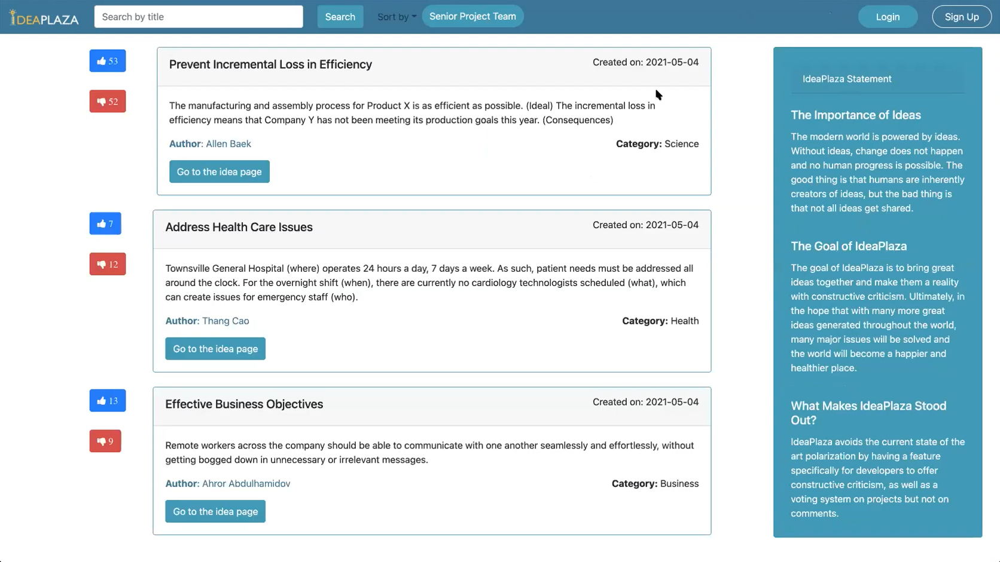
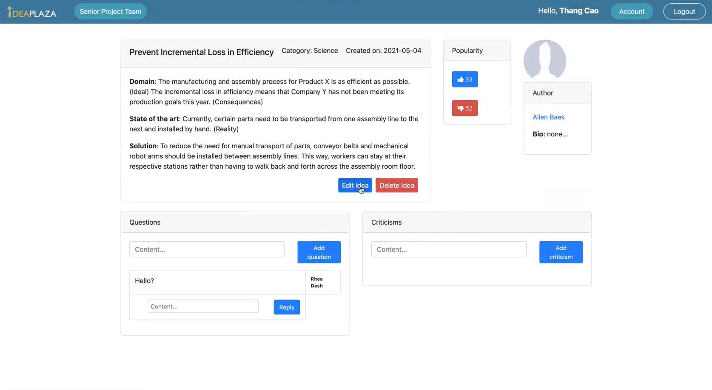
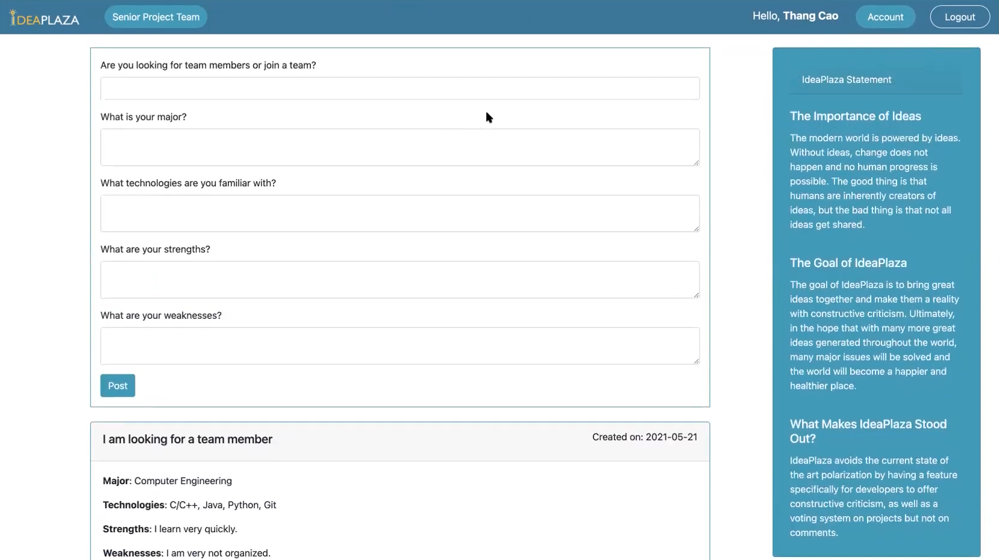
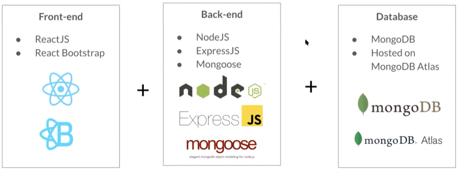

# IdeaPlaza

IdeaPlaza is a web-based platform that allows its users to view and create project ideas. Registered users will be allowed to post, vote, comment, and criticize on project idea posts, or seek for team members among students for their upcoming senior project. The project was made as part of the academic project for the Spring 2021 Software Engineering II course at San Jose State University by a team of 4 students: Thang Cao, Rhea Dash, Allen Baek, Ahror Abdulhamidov.

## Screenshots

Registration page

Home page

Idea page

Senior project page

## Technologies Used

The web application is built using JavaScript related technologies. For the front end, React is used as the JavaScript framework and ReactBootstrap with Bootstrap CSS is used for styling the application. For the server, Node.JS is used as the JavaScript backend framework along with other libraries such as Express and Mongoose, and the data is managed using MongoDB database management system. The Mongo database will is hosted on the MongoDB Atlas cloud database service.

